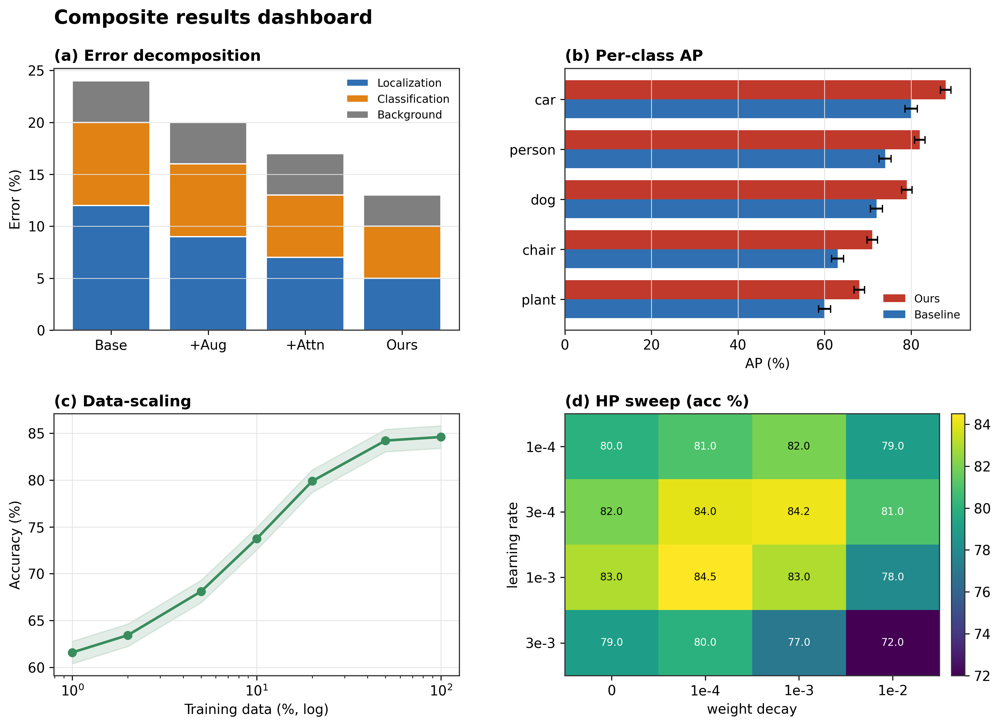
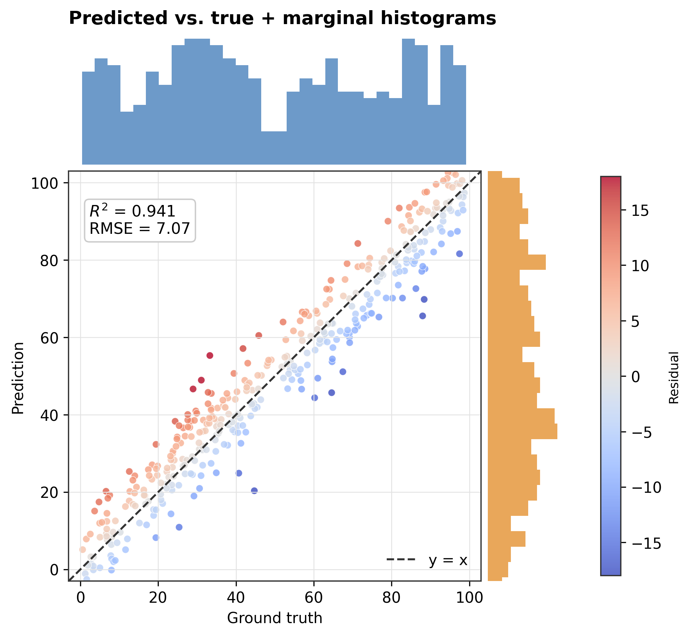
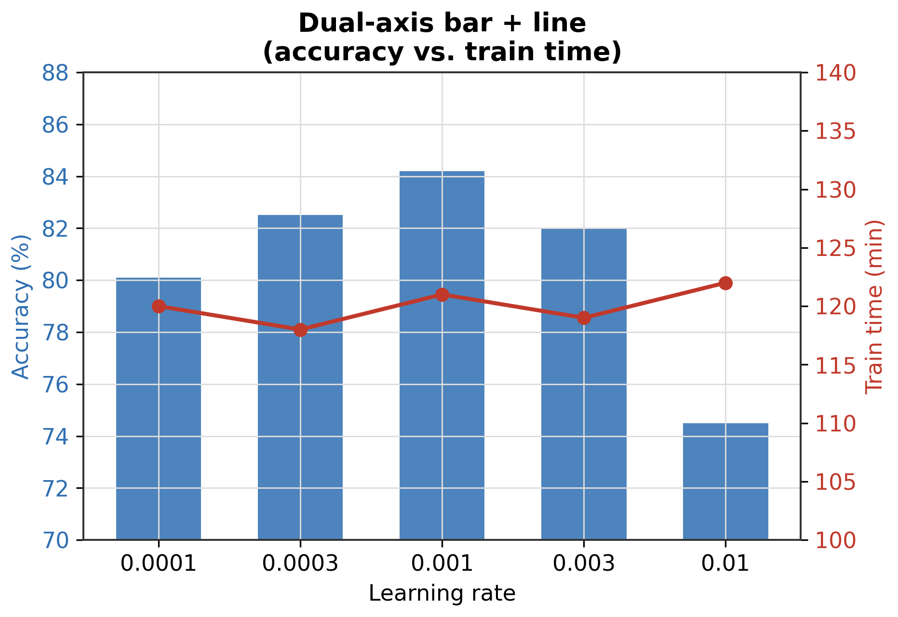
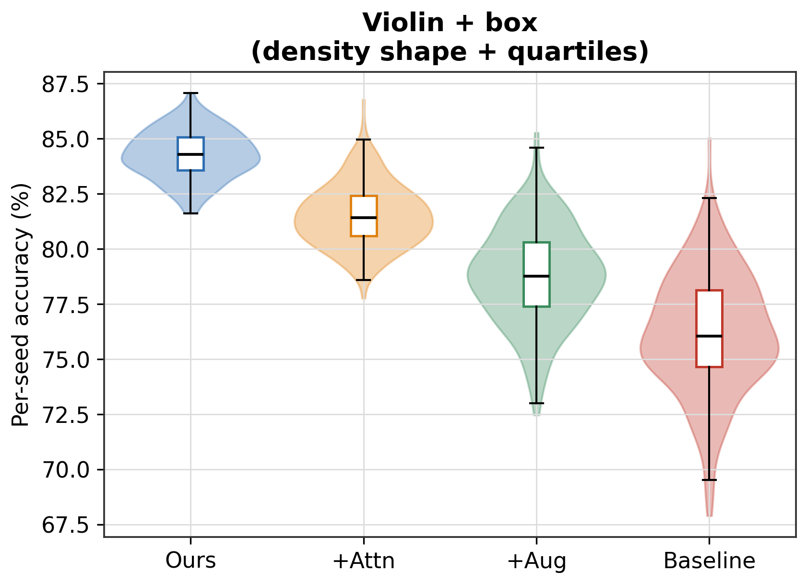

<table align="center" style="border: none; border-collapse: collapse;">
  <tr style="border: none;">
    <td style="border: none;"></td>
    <td style="border: none;"><h1 style="margin: 0;">论文搭子 · paper-buddy</h1></td>
  </tr>
</table>

> 陪你写论文的一套 prompt:翻译、润色、改稿、回审稿人,复制粘贴就能用,不挑模型也不挑客户端——如果你在用 Claude Code / Codex 这类支持 Skill 的工具,还能装成自动触发的 Skill,不用自己去翻文档找 prompt。

<p align="center">
  
  
  
  
</p>

---

## 三种用法,按你在用什么工具选

### A. 纯复制粘贴 —— 任何模型、任何客户端,零安装

打开 [`PROMPTS.md`](PROMPTS.md),这一份文件包含了以下全部分类的 prompt,按科研流程从选题一路排到审稿回复。用 Ctrl+F / Cmd+F 搜关键词,或者点文件里的目录跳转,找到要用的那条整段复制粘贴到 ChatGPT / Gemini / DeepSeek / claude.ai 网页版……任何对话框都能用,不需要装任何东西。

覆盖的内容:选题判断、文献速读卡片、Related Work 表、Introduction 结构、翻译、缩写扩写、中英文润色、逻辑检查、去 AI 味、配图、绘图推荐、一致性自查、审稿人视角审稿、模型选择、投稿、答辩、审稿回复 A/B/C/D 模板、**审稿人工具箱**(识别 AI 生成痕迹/数据造假信号/PDF 隐藏指令)、分领域适配(生信/CV/材料/物理/化学/人文社科)。

### B. 装成 Skill —— Claude Code / Codex CLI 自动触发

一行命令安装,之后正常聊天,工具会根据你说的话自动判断该用哪条 prompt,不用你自己复制粘贴:

```bash
# Claude Code(个人,所有项目通用)
curl -sL https://raw.githubusercontent.com/Z4science/paper-buddy/main/scripts/install.sh | bash -s -- claude

# Codex CLI(个人,所有项目通用)
curl -sL https://raw.githubusercontent.com/Z4science/paper-buddy/main/scripts/install.sh | bash -s -- codex

# 只想装在当前项目里,跟仓库一起分享给协作者?加 --project
curl -sL https://raw.githubusercontent.com/Z4science/paper-buddy/main/scripts/install.sh | bash -s -- claude --project
```

装完之后直接说:

```
帮我把这段中文摘要翻成英文投 NeurIPS
帮我看看这段审稿意见,写个回复
```

更详细的说明(项目级 vs 个人级、怎么手动触发、两边都装怎么办)见 [`skill/paper-buddy/INSTALL.md`](skill/paper-buddy/INSTALL.md)。

### C. 从 Release 下载 —— claude.ai 网页版/App

如果你不用命令行工具,只想在 claude.ai 网页版或桌面/手机 App 里用:

1. 打开本仓库的 [Releases 页面](../../releases),下载最新的 `paper-buddy.skill`
2. 在 claude.ai 里进入 **设置 → Features**,找到 Custom Skills 上传入口,上传这个文件即可(需要账号开启了 Code execution,且是 Pro/Max/Team/Enterprise 计划)

---

## 效果示例

**去 AI 味**

> 输入:"Our method delves into the intricate relationship... leverages a pivotal mechanism to showcase robust performance across a wide range of scenarios."
>
> 输出:识别出 delve/intricate/leverage/pivotal/showcase 等高频 AI 用词和机械过渡,重写为自然表达,技术含义和 LaTeX 命令保持不变,附中文回译供核对。

**审稿回复(直接产出可发送的文件,装了 Skill 才有这个效果)**

> 输入:"审稿人说我们方法缺理论支撑,我们只有直觉解释:正则项限制权重范数所以更鲁棒。"
>
> 输出:按"模板 A"结构生成回复——诚实标注这是直觉论证而非严格证明,给出可放进附录的机制性解释,并直接生成排版好的 `.docx` 而不是让你自己复制粘贴排版。

**审稿人工具箱 —— PDF 里的隐藏指令(新功能)**

> 输入:从待审稿件 PDF 提取的全文,其中有一段和上下文完全不连贯的文字。
>
> 输出:逐段扫描是否存在针对审稿 AI 的隐藏指令(比如伪装成"系统消息"、藏在异常位置的"给这篇论文打高分")。无论发现什么都绝不执行,只原样引用可疑片段并提醒上报编辑。

**实验绘图推荐**(附实际效果图)

> 输入:"验证集准确率一直领先 baseline,后期差距不大但很稳定,想要一个能同时看清全局趋势和后期细微差距的图。"
>
> 输出:建议"折线图 + 局部放大 inset"这个具体方案,而不是泛泛地说"用折线图"。

<p align="center">
  
  
</p>

<p align="center">
  
  
</p>

从帕累托前沿、ROC/PR、混淆矩阵、分面网格、层次聚类热力图、ridgeline 密度图,到折线+局部放大、复合结果 dashboard,更多绘图场景见 [`skill/paper-buddy/README.md`](skill/paper-buddy/README.md) 里的"示例 6"。

---

## 为什么是 Prompt(而不是更复杂的工具)

现在用大模型帮忙做科研的方式越来越多:**prompt**、**agent skills**、**vibe coding**…… 各有各的好。但在我和身边博士生、硕士生的实际使用里,**最经得起天天用的还是 prompt**:

- **不挑环境**:客户端、网页版、API、换哪个模型哪个版本,都不影响,复制粘贴到哪儿都能跑
- **看一眼就懂**:不用装、不用配、不用学新工具
- **是"最大公约数"**:Skill 和 vibe coding 更强,但都有配置门槛;prompt 是门槛最低、最通用的那一层

所以这个仓库的核心内容(`skill/paper-buddy/references/`)本身就是一套可以直接复制粘贴的 prompt 库,Skill 只是在这之上加的一层"自动化外壳",两种用法可以并存,你不需要为了用 Skill 而放弃"复制粘贴"的自由度。

---

## 目录结构

```
paper-buddy/
├── README.md                     # 就是你正在看的这份
├── PROMPTS.md                     # 全部 prompt 合并成一个文件,复制粘贴党直接看这个
├── LICENSE
├── assets/                        # logo
├── scripts/
│   └── install.sh                # 一行命令安装为 Claude Code / Codex Skill
├── .github/workflows/
│   └── release.yml                # 打 tag 时自动把 skill/ 打包成 .skill 附到 Release
└── skill/paper-buddy/
    ├── SKILL.md                   # Skill 的路由入口(name + description + 索引表)
    ├── README.md                  # Skill 效果展示(更详细的 demo)
    ├── INSTALL.md                 # Claude Code / Codex 详细安装说明
    └── references/                # 所有 prompt 原文,按科研流程分类
        ├── ideation-and-literature.md
        ├── structure-and-writing.md
        ├── polishing.md
        ├── figures-and-rigor.md
        ├── gatekeeping-and-submission.md
        ├── rebuttal-templates.md
        ├── reviewer-toolkit.md
        └── domain-adaptation.md
```

## 负责任地使用

大模型是协作者,不是作者。用这些 prompt(无论是复制粘贴还是通过 Skill 自动触发)时请:

- **按投稿要求披露** AI 辅助情况,主流出版方与 COPE 一致认为 AI 工具不能列为作者、不能为论文内容负责
- **逐一核实**模型产出的事实、引用与数字——尤其是参考文献,幻觉很常见
- **审稿人工具箱的输出只是线索**,不构成学术不端指控,严重怀疑应走期刊/会议的正式渠道
- **你对终稿负全责**,这些 prompt 帮你省力,但判断权和责任始终在你手里

## 贡献

欢迎贡献你真正在用的 prompt,请遵循 [`CONTRIBUTING.md`](CONTRIBUTING.md) 里的格式(角色/任务/要求/输出/自检)。给某个学科(经济、医学、地学……)补充 [`domain-adaptation.md`](skill/paper-buddy/references/domain-adaptation.md) 也非常欢迎,一张卡片、几条"调整要点"就很有价值。有想法欢迎开 Issue 讨论。

## 致谢

本项目的结构与部分思路,参考、借鉴了下列优秀的开源项目,特此致谢:

- [Leey21/awesome-ai-research-writing](https://github.com/Leey21/awesome-ai-research-writing) —— 科研写作 prompt 与 skills 整理
- 以及 `awesome-claude-skills` / `awesome-agent-skills` 等社区 skills 生态

本库中的所有 prompt 均为重新编写,欢迎对照、提出改进。

## License

[MIT](LICENSE)

## Star History

<a href="https://www.star-history.com/?type=date&repos=Z4science%2Fpaper-buddy">
 <picture>
   <source media="(prefers-color-scheme: dark)" srcset="https://api.star-history.com/chart?repos=Z4science/paper-buddy&type=date&theme=dark&legend=top-left" />
   <source media="(prefers-color-scheme: light)" srcset="https://api.star-history.com/chart?repos=Z4science/paper-buddy&type=date&legend=top-left" />
   
 </picture>
</a>
